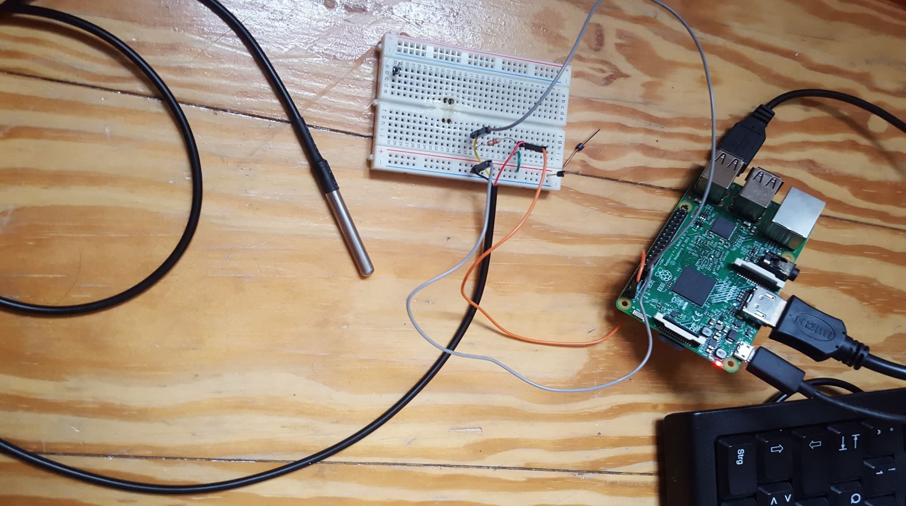
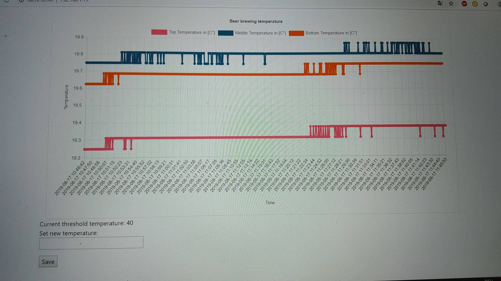

# Beertastic Pi

Raspberry Pi for temperature control and logging with classsic beginner style beer brewing equipment.
It provides a UI for different temperature sensors, and can be connected to a "smarkt Plug" to turn the heating on/off.
A webam can also be plugged in to monitor the current status of the brewing.

## Installation

You need:

* Raspberry Pi
* at least one Teperature Sensor ( I use a DS18B20 waterproof Version)
    * I use 3 different sensors ( bottom and top temperature in the brewing pot, as well as outside temperature) I
* a smart plug (and corresponding base station)
  * mine is compatible with the Hue 

## Usage

clone repo

Modify the script `write_temp_to_file.py` with your sensor IDs.

Modify the IP of your smart plug device in `run_beer_temp_hue_multi.py`.

Start the script `write_temp_to_file.py` , then start script `run_beer_temp_hue_multi.py`.

## Setup example
Wiring of a single sensor attached to the pi.

Example of the flask app with temperature logging, and setting of heating threshold value:

